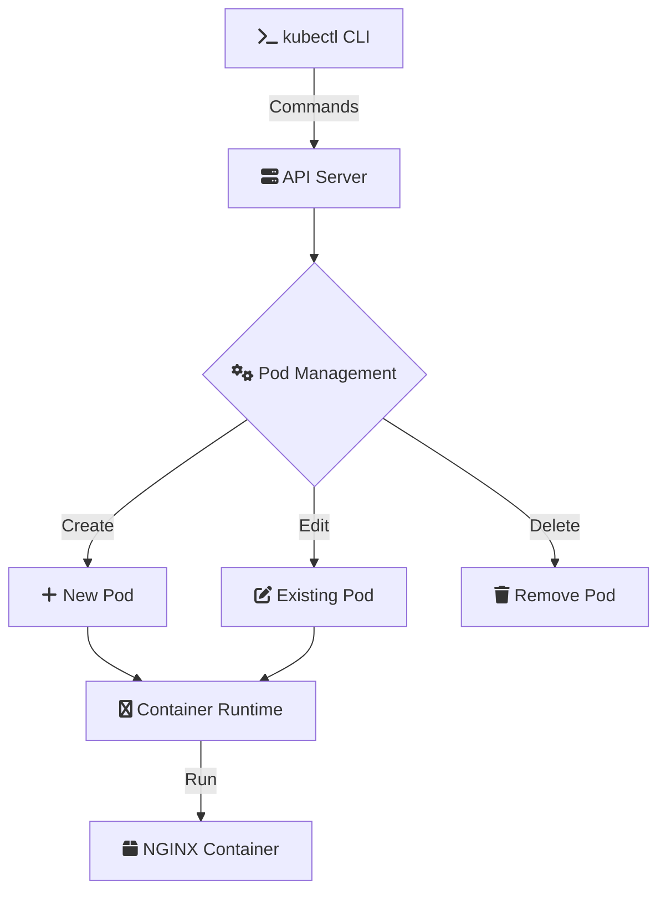

# 🚀 Kubernetes Pod Management: Edit Pod Implementation
[](https://github.com/TheToriqul/k8s-edit-pod)
[](https://github.com/TheToriqul/k8s-edit-pod/stargazers)


## 📋 Overview

A practical implementation demonstrating Kubernetes pod management capabilities, focusing on pod editing workflows and configuration management. This project serves as a comprehensive guide for DevOps engineers and Kubernetes administrators, showcasing proper pod update strategies and configuration handling in a Kubernetes environment. The implementation provides hands-on experience with real-world Kubernetes operations.

## 🏗 Technical Architecture

The architecture demonstrates the workflow of pod editing in Kubernetes, emphasizing the interaction between different components.



## 💻 Technical Stack

- **Container Orchestration**: Kubernetes v1.19+
- **Container Runtime**: Docker
- **Web Server**: NGINX 1.26
- **CLI Tools**: kubectl
- **Configuration**: YAML

## ⭐ Key Features

1. Pod Lifecycle Management
   - Dynamic pod creation
   - Configuration updates
   - Graceful termination

2. Configuration Handling
   - YAML extraction
   - Field validation
   - Version control

3. Container Management
   - Image versioning
   - Port mapping
   - Resource allocation

4. Operational Workflows   - Status monitoring
   - Health checking
   - Error handling

## 📚 Learning Journey

### Technical Mastery:

1. Kubernetes pod lifecycle management
2. YAML configuration handling
3. Container orchestration
4. Resource definition management
5. kubectl operations mastery

### Professional Development:

1. Infrastructure as Code practices
2. Configuration management
3. Documentation skills
4. Troubleshooting methodology
5. Best practices implementation

## 🔄 Future Enhancements

<details>
<summary>View Planned Improvements</summary>

1. Multi-container pod implementations
2. Custom resource definitions
3. Advanced networking configurations
4. Service mesh integration
5. Automated testing framework
6. CI/CD pipeline integration
</details>

## ⚙️ Installation

<details>
<summary>View Installation Details</summary>

### Prerequisites

- Kubernetes cluster (v1.19+)
- kubectl CLI tool
- Docker runtime
- Access to container registry

### Setup Steps

1. Clone the repository:
```bash
git clone https://github.com/TheToriqul/k8s-edit-pod.git
cd k8s-edit-pod
```

2. Create the initial pod:```bash
kubectl run my-nginx --image=nginx:1.26 --port=80```

3. Verify the pod creation:
```bash
kubectl get pods
```
</details>

## 📖 Usage Guide
<details>
<summary>View Usage Details</summary>

### Basic Usage

1. Export pod configuration:
```bash
kubectl get pod my-nginx -o yaml > my-new-pod.yaml
```

2. Edit configuration:
```bash
vim my-new-pod.yaml
```

3. Apply changes:
```bash
kubectl delete pod my-nginx
kubectl create -f my-new-pod.yaml
```

### Troubleshooting

- Check pod status: `kubectl get pods`
- View pod details: `kubectl describe pod my-nginx`
- Access logs: `kubectl logs my-nginx`

</details>

## 📫 Contact

- 📧 Email: toriqul.int@gmail.com
- 📱 Phone: +65 8936 7705, +8801765 939006

## 🔗 Project Links

- [GitHub Repository](https://github.com/TheToriqul/k8s-edit-pod)

## 👏 Acknowledgments

- [Poridhi for excellent labs](https://poridhi.io/)
- The Kubernetes community
- Docker and NGINX teams

Feel free to explore, modify, and build upon this configuration as part of my learning journey. You're also welcome to learn from it, and I wish you the best of luck!